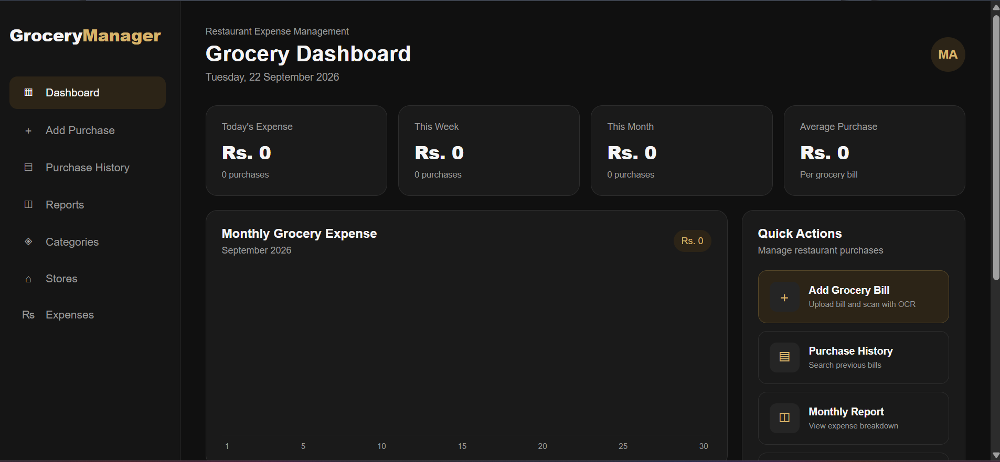
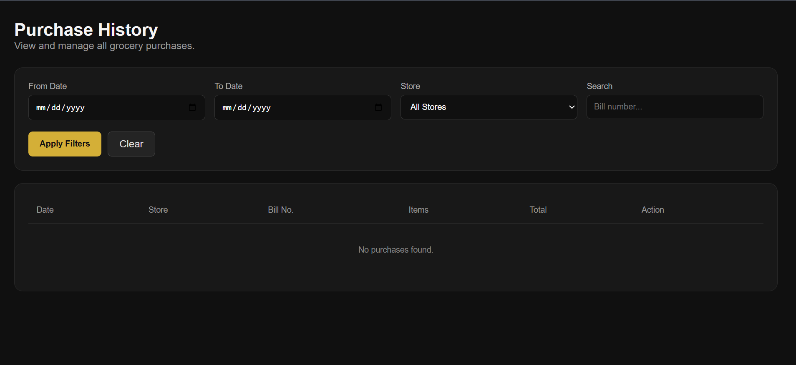
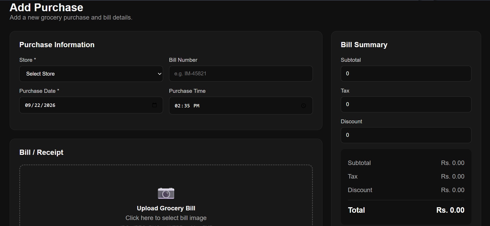
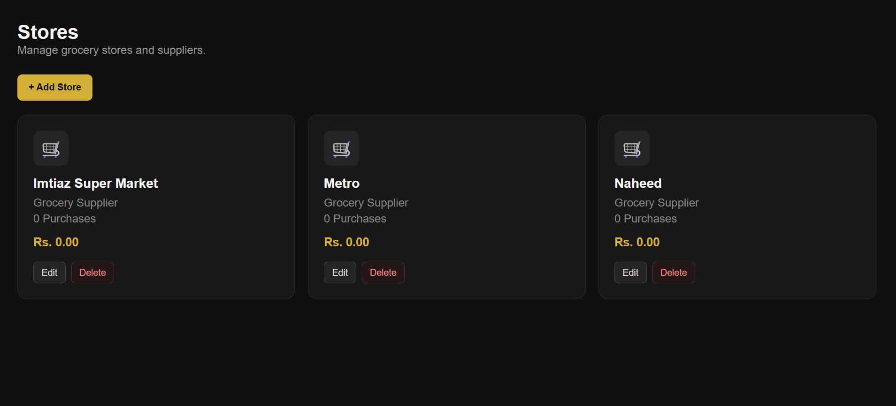
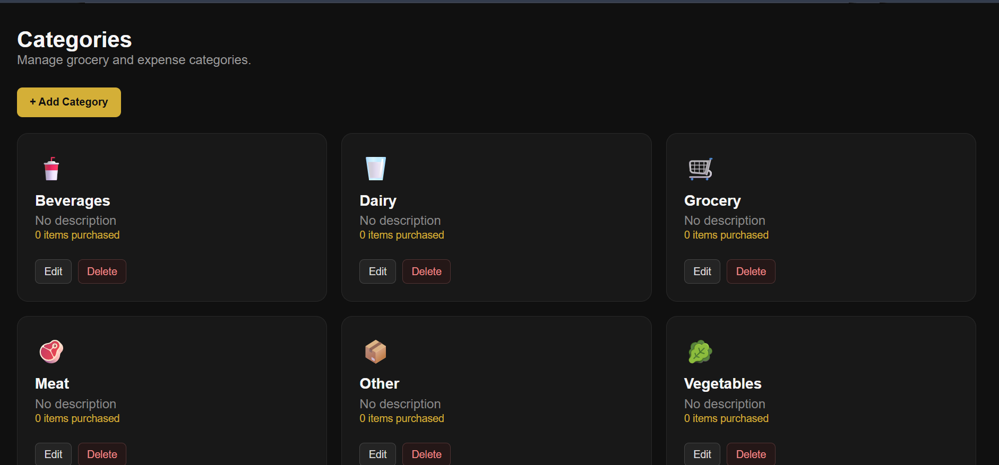
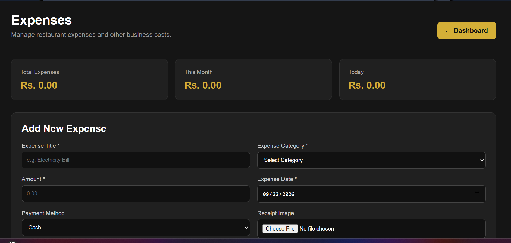

# Grocery Expense Manager

A web-based grocery expense management system built with PHP and MySQL to help manage purchases, stores, categories, and expense records in one place.

## Overview

Grocery Expense Manager is designed to simplify the process of recording and tracking grocery purchases. It provides a centralized dashboard for monitoring expenses and maintaining purchase history.

The project is currently being developed with a focus on practical expense management and bill-based data entry.

## Features

* Dashboard with expense overview
* Purchase management
* Purchase history
* Store management
* Category management
* Expense tracking
* Store-wise purchase records
* Monthly and daily expense summaries
* Bill image handling
* OCR integration for extracting information from bills

## Technologies Used

* PHP
* MySQL
* HTML5
* CSS3
* JavaScript
* Bootstrap
* Tesseract OCR
* XAMPP

## Screenshots

### Dashboard



### Purchase History



### Purchase Details



### Stores



### Categories



### expense



## Project Structure

```text
grocery-expense-manager/
├── screenshots/
├── assets/
├── uploads/
├── includes/
├── index.php
├── db.php
└── ...
```

## Installation

### 1. Clone the repository

```bash
git clone https://github.com/muhammadbinaamir018-source/grocery-expense-manager.git
```

### 2. Move the project

Place the project inside your XAMPP `htdocs` directory:

```text
C:\xampp\htdocs\
```

### 3. Create the database

Create a MySQL database using phpMyAdmin and import the project's database structure.

### 4. Configure the database

Update the database connection settings in:

```text
db.php
```

### 5. Start XAMPP

Start:

* Apache
* MySQL

Then open:

```text
http://localhost/grocery_manager/
```

## OCR

The project uses Tesseract OCR to experiment with extracting information from grocery bills and reducing manual data entry.

## Future Improvements

* Improve automatic bill data extraction
* Better OCR accuracy for grocery receipts
* Automatic item and price detection
* Expense analytics and visual reports
* Improved bill processing workflow
* More advanced reporting features

## Author

**Muhammad Bin Aamir**

BS Computer Science Student
Pakistan

---

⭐ If you find this project useful, feel free to explore the repository.
